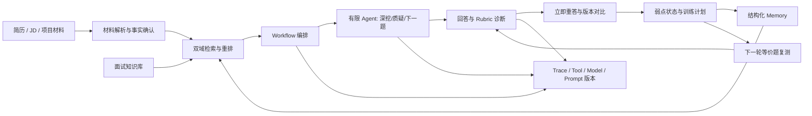

# AI Mock V2 产品与开发规格

> 文档状态：Draft v0.1  
> 创建日期：2026-08-16  
> 负责人：唐瑱  
> 用途：把 8.16 Mock 面试中关于 AI Mock 项目的反馈，转成可执行、可验收、可复盘的下一阶段开发计划。

## 0. 先看结论

AI Mock V2 不应继续以“更像真人面试官”为主目标，而应升级为一套**基于用户真实证据、能够持续修复表达弱点的面试训练教练**。

V2 的核心闭环是：

`用户材料 → 双域检索 → 针对性提问 → 动态追问 → 证据化诊断 → 立即重答 → 前后对比 → 弱点写入 Memory → 下轮定向复测`

当前最佳下一步不是先增加语音、压力面试或更强模型，而是：

1. 找到实际代码仓库并跑通现有基线；
2. 实现一条最小纵向闭环：**反馈 → 重答 → 对比 → 弱点记录 → 下一轮复测**；
3. 同时为每次检索、模型调用、追问决策和评分建立 Trace，使产品效果和工程问题都能被归因。

本文中的事实分为三类：

- `已验证`：由现有项目材料或历史代码审计支持；
- `面试官建议`：来自 8.16 Mock 逐字稿；
- `方案推导`：为落实建议形成的产品或技术设计，尚未实现；
- `[待确认]`：当前材料不足，不能当作事实使用。

---

## 1. 需求来源与反馈映射

| 面试反馈 | 类型 | 转化后的开发要求 | 优先级 |
|---|---|---|---|
| 项目缺少“用户怎么用、完整体验、是否有效”的产品闭环 | 面试官建议 | 增加反馈后重答、前后对比、训练计划、下轮复测和真实用户试点 | P0 |
| 第一性原理是帮助用户理解并讲清自己的项目，而非只模拟真实面试 | 面试官建议 | 将“弱点是否被修复”设为核心结果，“真实感”降为辅助体验 | P0 |
| 问答结束后要继续跟进，让用户真正吸收反馈 | 面试官建议 | 报告页不能成为终点；必须有可执行动作和复测入口 | P0 |
| 当前缺少技术架构、Harness、真实 Coding 问题与验证过程 | 面试官建议 | 建立运行轨迹、版本、日志、失败归因、回放与回归机制 | P0 |
| 当前设计更像 Flow，不必为了 Agent 而 Agent 化 | 面试官建议 | 固定主链路用 Workflow；只让有限 Agent 做动态追问和 Tool 选择 | P0 |
| 不应把大量面经压缩进一个 Skill/System Prompt | 面试官建议 | 建立面经数据库与检索 Tool，按主题、岗位和公司召回 | P1 |
| 需要说明面经采集、清洗和平台风控 | 面试官建议 | 增加来源、授权状态、清洗、去重、质量和更新时间字段 | P1 |
| Memory 应记录用户偏好、历史缺陷和项目，而非只存聊天记录 | 面试官建议 | 建立结构化、可溯源、可编辑和可删除的用户 Memory | P1 |
| 鼓励型、压力型等风格可通过 Prompt 定义，但不是核心 | 面试官建议 | 风格模式放在核心闭环验证之后 | P2 |
| “直接换更强模型”会带来成本与安全追问 | 面试官建议 | 模型可替换；用同集评测比较质量、延迟、成本和安全，不以模型强弱代替系统设计 | P0 |
| 评测不能只看最后一轮 Query，要能解释上下文、Tool 和步骤错误 | 面试官建议 | 保存完整 Run/Tool/Retrieval/Decision Trace，并建立阶段归因标签 | P0 |

主要来源：

- [Mock1.md](./AI产品mock%208.16/Mock1.md)：L223–295，AI Mock 需求、Workflow/Agent、RAG、Memory、产品闭环反馈；
- [Mock2.md](./AI产品mock%208.16/Mock2.md)：L39–118，Coding/Harness、上下文与归因反馈；
- [Mock Fraft for Tian.md](./AI产品mock%208.16/Mock%20Fraft%20for%20Tian.md)：项目改进记录。

> 注意：逐字稿中“约 1000–2000 条面经”是口头陈述。其数量、来源许可、采集方式、去重和质量目前均为 `[待确认]`，不能写成已完成的数据资产。

---

## 2. 当前基线与证据边界

### 2.1 已有能力

根据现有简历稿和历史代码审计，当前版本已经覆盖：

- 简历解析；
- 基于用户证据的提问；
- 最多两轮动态追问；
- Rubric 评分与复盘；
- 进度追踪；
- Next.js、TypeScript、PostgreSQL/Prisma、Redis/BullMQ 技术栈；
- 14 个页面、27 个 API Route、10 个数据库迁移、18 项自动化测试；
- 300+ 条分层离线评测样本，覆盖结构校验、幻觉检测和安全降级等场景。

以上工程数字来自此前材料与历史审计。本轮在当前工作区未找到 AI Mock 代码仓库，因此尚未重新执行测试；准确仓库路径、当前分支、运行命令和最新代码状态均为 `[待确认]`。

### 2.2 已知边界

- 已证明的是产品链路可运行和内部测试通过；
- 尚未证明真实用户留存、面试能力提升、付费意愿或 PMF；
- 300+ 是离线评测样本，不是自动化测试数量；
- 评测样本的历史统计存在 314/318 的口径差异，因此对外只使用“300+”；
- AI 辅助生成了部分代码；产品定义、MVP、架构、接口、评测与验收由本人主导。面试时需继续保持这一所有权边界；
- 当前是否已有真实 RAG、结构化 Memory、工具调用 Trace 和生产环境监控，需要回到代码仓库核验。

### 2.3 当前最关键缺口

| 缺口 | 现状 | V2 必须补齐的证据 |
|---|---|---|
| 产品价值 | 能完成一次 Mock，但报告后是否改善未知 | 同一弱点的首次回答、重答、复测及变化 |
| 用户验证 | 正准备找同学测试 | 明确样本、任务、观察指标、原始反馈和结论 |
| 数据链路 | 面经数量和处理方式不可审计 | 来源、许可、清洗、去重、标签、检索命中记录 |
| 个性化 | 有历史记录概念，Memory 边界不清 | 可溯源的项目事实、弱点状态、偏好和复测历史 |
| 工程可解释性 | 主要描述最终功能 | Run、Retrieval、Tool、Decision、Score 的完整 Trace |
| Coding 故事 | 缺少具体问题—定位—修复—回归证据 | 至少一个真实故障记录和可复现回归测试 |

---

## 3. 产品定义

### 3.1 一句话定位

AI Mock V2 是一个面向 AI 产品岗位候选人的证据驱动型面试训练教练：它基于简历、JD、项目材料和历史弱点进行提问，通过追问、评分、重答和定向复测，帮助用户把真实项目讲得更清楚、更可信。

### 3.2 首期目标用户

`方案推导`：首期聚焦正在准备 AI 产品实习或校招、已有简历与项目经历、但缺少高质量重复反馈的候选人。用户范围和代表性仍需通过访谈/试点验证，不扩写为所有求职者。

典型触发场景：

- 目标面试在未来 1–4 周内；
- 用户知道项目事实，但回答容易散、缺数据、责任边界不清；
- 用户能获得一次反馈，却不知道怎样修改，也无人复测；
- 用户希望围绕具体 JD 和自己的材料练习，而不是刷通用题库。

### 3.3 用户核心任务

> 当我准备一场目标岗位面试时，我希望系统找出我项目表达中的关键缺口，告诉我怎样修复，并在之后重新检验，让我能在真实面试中用有证据、可追问的方式讲清项目。

### 3.4 可证伪的产品假设

如果系统将反馈直接连接到重答和定向复测，并用用户真实证据约束提问与评分，那么目标用户在同类题目的核心弱点上会出现可测量改善，并愿意在 7 日内回来完成下一轮训练。

若用户只查看报告、不重答；重答后得分无稳定改善；或 7 日内没有定向复测行为，则该假设未被支持，需要先修正反馈质量、任务成本或目标用户，而不是继续增加“仿真感”。

### 3.5 目标与非目标

V2 目标：

- 让反馈转化为可观察的行为和能力变化；
- 让问题、追问和反馈均能追溯到用户证据或面试知识来源；
- 让系统的错误能定位到数据、检索、上下文、模型、工具、评分或交互环节；
- 形成可用于下一轮面试深挖的真实产品、工程和用户验证证据。

V2 非目标：

- 不以“像真人”或“压力更强”作为第一阶段成功标准；
- 不强行把所有流程改造成自治 Agent；
- 不通过无约束地堆更强模型解决系统性问题；
- 不在数据许可不清的情况下扩大爬取；
- 不在验证前宣称提升了用户面试能力、留存或 PMF。

---

## 4. V2 最小用户闭环

### 4.1 主流程

1. 用户创建目标：选择岗位/公司，上传简历、JD 和可选项目材料。
2. 系统抽取候选人事实，要求用户确认关键指标与责任边界。
3. 系统从“用户证据域”和“面试知识域”联合检索，生成有来源的主问题。
4. 用户回答；有限 Agent 只在 `深挖 / 质疑 / 下一题 / 结束` 中做结构化决策，最多追问两轮。
5. 系统按固定 Rubric 评分，逐条标出证据充分点、缺口和可执行修改动作。
6. 用户选择一个核心弱点并立即重答。
7. 系统用同一 Rubric 和固定版本比较前后回答，解释哪些地方改善、哪些仍未改善。
8. 系统仅把已确认事实、稳定弱点和训练状态写入 Memory。
9. 系统生成下一轮定向训练任务，在 7 日内用等价题复测，而非简单重复原题。
10. 用户完成复测后，系统更新弱点状态并展示趋势。

### 4.2 闭环完成定义

一次“训练闭环”不是完成一场模拟，而是同时满足：

- 完成至少一个关键问题的首次回答；
- 查看具体反馈；
- 完成一次基于反馈的重答；
- 看到前后差异和剩余问题；
- 生成一个有到期时间的定向复测任务。

### 4.3 系统逻辑图



---

## 5. 功能需求与验收标准

### P0：先证明“用户真的变好”

| ID | 功能 | 最小验收标准 |
|---|---|---|
| FR-001 | 用户证据确认 | 抽取的项目事实、指标和个人/团队边界可逐条确认、修改或标记未知；未确认事实不得作为确定事实写入反馈 |
| FR-002 | 受控面试 Workflow | 主流程状态明确；Agent 只能输出枚举决策和理由；最多两轮追问；异常时可退回固定问题 |
| FR-003 | 证据化反馈 | 每条事实性评价能关联用户证据或明确标记“材料未提供”；不得替用户补造经历和数字 |
| FR-004 | 立即重答 | 用户可在同一题下基于反馈创建第二次回答；首次回答不可被覆盖 |
| FR-005 | 前后对比 | 使用同一 Rubric/版本展示分维度变化、采纳了哪些建议、仍缺什么；保留原文和分数版本 |
| FR-006 | 弱点状态 | 每场最多沉淀 3 个优先弱点，包含证据、严重度、状态、来源 Attempt 和复测时间 |
| FR-007 | 定向复测 | 能为弱点生成等价而非原样重复的问题；复测后更新为“未改善/改善中/已通过” |
| FR-008 | 基础 Trace | 每次 Run 可追踪输入引用、检索结果、模型/Prompt 版本、Agent 决策、Tool 调用、延迟、错误、评分和降级 |
| FR-009 | 用户验证事件 | 记录开始、完成、报告查看、重答、反馈采纳、训练计划创建、复测完成等事件 |
| FR-010 | 隐私控制 | 用户可查看、修改和删除 Memory；删除请求覆盖原始材料、派生向量、摘要和训练状态 |

### P1：提升内容质量和个性化

| ID | 功能 | 最小验收标准 |
|---|---|---|
| FR-101 | 面经知识库 | 每条内容有来源、采集方式、许可状态、岗位/公司/能力标签、去重哈希、质量状态和更新时间 |
| FR-102 | 双域检索 | 出题同时使用用户证据域与面试知识域；返回来源 ID、分数和过滤条件；无召回时明确降级 |
| FR-103 | 面经检索 Tool | 支持公司、岗位、能力主题、项目关键词、题型和难度过滤；输出结构化结果，不把全库塞入 Prompt |
| FR-104 | 结构化 Memory | 区分已确认事实、偏好、弱点、训练历史和临时上下文；每条 Memory 有来源、置信度、更新时间和可删除状态 |
| FR-105 | 个性化训练计划 | 结合 JD、证据缺口、历史弱点和练习记录安排下一题，并展示选择理由 |
| FR-106 | 分模块评测 | RAG、Memory、Tool、追问决策和评分分别有离线用例与失败分类 |

### P2：增强沉浸体验

| ID | 功能 | 最小验收标准 |
|---|---|---|
| FR-201 | 面试风格 | 支持鼓励型、业务深挖型、压力型；风格只能改变措辞和追问力度，不能改变事实标准和评分口径 |
| FR-202 | 语音与限时 | 在文字闭环验证后再评估；需单独测识别错误、打断、延迟和无障碍体验 |
| FR-203 | 长期趋势 | 按能力维度展示多轮变化，明确 Rubric/模型版本变化，避免不可比的伪趋势 |

---

## 6. 技术方案

### 6.1 架构原则

1. **Workflow 是骨架。** 材料处理、提问、记录、评分、重答、复测和落库的状态转移由确定性流程控制。
2. **Agent 能力有边界。** 只在需要语义判断或只读 Tool 选择时使用，并限制可选动作、轮次、超时和预算；Agent 只能提出下一步建议，不能直接修改会话状态、Memory 或分数。
3. **RAG 解决知识获取，不等于 Memory。** 面经和用户材料通过检索进入当次上下文；Memory 表示跨会话持续有效的用户状态。
4. **Prompt 不是数据库。** 大规模面经不得压进单一 Skill/System Prompt。
5. **PostgreSQL 是业务事实源。** Redis 只承担缓存、限流和 BullMQ 队列，不保存唯一业务事实；回答先持久化，再通过 Outbox/幂等任务进入异步评分。
6. **出题与评分职责分离。** 面试 Agent 不直接给自己的问题评分，评分服务使用冻结的 Rubric 与证据快照，降低“自己出题、自己判好”的偏差。
7. **所有输出可回放。** Prompt、模型、检索、工具、决策、Rubric 和证据快照均要版本化。
8. **先建立基线再设提升值。** 模型质量、人机一致性、延迟和成本阈值在基线测量后确定，不捏造目标。

建议的会话状态机：

`CREATED → CONTEXT_READY → QUESTION_READY → AWAITING_ANSWER → DECIDING → FOLLOW_UP/SCORING → FEEDBACK_READY → RETRY_AVAILABLE → COMPLETED → RETEST_SCHEDULED`

每个状态转换必须由 Workflow Controller 校验并持久化；模型输出不能直接推动数据库进入任意状态。

### 6.2 双域 RAG

#### A. 用户证据域

数据包括：简历、JD、项目材料、用户确认的指标、个人/团队边界、历史回答与纠正记录。

检索目标：找到“这个问题可以基于用户的哪些真实事实来问和评”，并阻止模型补造背景。

#### B. 面试知识域

数据包括：经过许可和清洗的真实面经、岗位能力模型、题型、Rubric、常见追问和公司偏好。

检索目标：找到“目标公司/岗位在该能力主题上可能如何提问”，而不是逐字复刻或大段输出来源内容。

#### 联合检索流程

`目标岗位与当前弱点 → Query 规划 → 两域召回 → 元数据过滤 → 重排 → 上下文组装 → 问题生成 → 来源检查`

必须保存：Query、过滤条件、Top-K 候选、重排结果、最终采用片段、未召回原因和来源 ID。

若 `pgvector` 或重排服务当前不可用，P0 可先采用全文检索/BM25 + 元数据过滤，并通过统一 Retriever 接口保留升级空间；检索失败时退回经过审核的通用题库，不得虚构用户经历。

### 6.3 结构化 Memory

| Memory 类别 | 示例 | 写入规则 |
|---|---|---|
| `project_fact` | “本人负责 Rubric 和 Bad Case 分析” | 用户确认或可定位到材料；保留来源 |
| `verified_metric` | “300+ 离线样本” | 必须记录口径、来源和确认状态 |
| `ownership` | 个人决定 / 参与 / 团队结果 | 不得由模型自行扩大个人所有权 |
| `weakness` | 指标无口径、回答未前置结论 | 至少有一个 Attempt 证据；可随复测更新 |
| `preference` | 90 秒回答、业务深挖风格 | 用户设置或重复行为确认 |
| `training_state` | 已重答、复测到期、是否通过 | 由确定性事件更新 |

原始聊天记录可以保留为 Session 证据，但不能未经校验直接成为长期事实。所有 Memory 均需支持来源追溯、用户修正、过期策略和级联删除。

### 6.4 有限 Agent 与 Tools

Agent 的结构化输出建议：

```json
{
  "decision": "DEEPEN | CHALLENGE | NEXT | STOP",
  "reason_code": "MISSING_EVIDENCE | VAGUE_OWNERSHIP | METRIC_UNCLEAR | OFF_TOPIC | COMPLETE",
  "evidence_refs": ["evidence_id"],
  "tool": "retrieve_candidate_evidence | retrieve_interview_patterns | none",
  "next_question": "string",
  "confidence": 0.0
}
```

约束：

- 最多两轮动态追问；
- 低置信度、Tool 失败或超时则退回 Workflow 预生成问题；
- Agent 不能修改用户事实和评分标准；
- Tool 只能读取当前用户授权范围内的数据；
- 每次决策都写入 Trace，并能在调试页解释“为什么追问”。

首期 Tools：

- `retrieve_candidate_evidence`：按问题和能力点检索用户证据；
- `retrieve_interview_patterns`：按公司、岗位、主题和题型检索面试知识；
- `get_training_memory`：读取相关弱点与练习状态；

`update_training_state` 不暴露给 Agent。它是 Workflow 内部的确定性服务命令，只能在既定状态转换和权限校验通过后执行。

### 6.5 Harness 与可观测性

每次运行生成唯一 `run_id`，至少记录：

- Session/Turn/Attempt ID；
- 输入材料引用与上下文长度；
- Prompt 模板、模型、参数和版本；
- 检索 Query、候选、采用结果和分数；
- Tool 名称、参数摘要、结果、耗时、重试和错误；
- Agent 决策、原因码、置信度和回退；
- Rubric 版本、分维度评分、证据引用和 Judge 版本；
- 总延迟、Token、估算成本、异常和最终状态；
- 用户行为：查看、采纳、重答、放弃、复测。

Trace 默认只保存记录 ID、哈希与脱敏摘要；原始简历和完整回答留在受控业务表中，避免日志变成第二套敏感数据仓库。Harness 还需支持按冻结版本重放失败 Run，并将真实 Bad Case 一键加入版本化回归集。

失败归因统一使用以下一级标签：

`INGESTION / RETRIEVAL / CONTEXT / ORCHESTRATION / MODEL / TOOL / JUDGE / ENGINEERING / UX`

每个 Bad Case 需要包含：预期、实际、首次异常节点、根因证据、修复提交/版本、回归用例和复测结果。这样既能改善系统，也能沉淀真实的 Coding/Harness 面试故事。

### 6.6 逻辑数据模型

以下为 V2 逻辑模型，实际 Prisma 表名和迁移方式需在找到仓库后确认。

| 实体 | 关键字段 | 作用 |
|---|---|---|
| `UserProfile` | user_id, consent_version, locale | 用户与授权 |
| `TargetRole` | company, role, jd_ref, competency_tags | 一次训练目标 |
| `SourceDocument` | type, uri, hash, permission, version | 简历/JD/项目/面经来源 |
| `DocumentChunk` | document_id, chunk_no, text_ref, embedding, metadata | 全文/向量检索单元 |
| `EvidenceItem` | claim, source_span, status, ownership, confidence | 可引用的用户事实 |
| `InterviewPattern` | source_id, question, tags, quality, rights_status | 可检索的面试知识 |
| `QuestionSource` | question_id, source_id, source_span | 问题到来源的可追溯关系 |
| `InterviewSession` | target_role_id, workflow_version, status | 一场训练 |
| `QuestionTurn` | question, source_refs, decision_ref | 主问题或追问 |
| `AnswerAttempt` | turn_id, attempt_no, answer, created_at | 首答、重答、复测答 |
| `RubricScore` | attempt_id, rubric_version, dimension, score, rationale | 分维度诊断 |
| `Weakness` | type, severity, evidence_ref, status, due_at | 可被复测的缺口 |
| `TrainingTask` | weakness_id, equivalent_question_id, status | 下轮任务 |
| `MemoryItem` | type, value, source_ref, confidence, expires_at | 跨会话个性化状态 |
| `RetrievalTrace` | query, filters, candidates, selected | RAG 可观测性 |
| `ToolTrace` | tool, args_hash, result_ref, latency, error | 工具可观测性 |
| `ModelRun` | model, prompt_version, context_refs, tokens, cost | 模型运行记录 |
| `OutboxJob` | business_key, job_type, status, retry_count | 异步任务不丢失与幂等 |
| `EvalDatasetVersion` | name, version, split, frozen_at | 评测集版本与数据切分 |
| `BadCase` | stage, expected, actual, root_cause, regression_case | 问题闭环 |

### 6.7 接口草案

接口仅用于明确模块边界，现有 27 个 Route 的真实路径和复用方式为 `[待确认]`。

| 方法与路径 | 目的 | 核心输出 |
|---|---|---|
| `POST /api/v2/materials` | 上传并解析用户材料 | document_id, proposed_evidence[] |
| `PATCH /api/v2/evidence/:id` | 用户确认或修改事实 | evidence_item |
| `POST /api/v2/retrievals/questions` | 双域召回和重排 | candidates[], selected_refs[], trace_id |
| `POST /api/v2/sessions` | 创建目标训练 | session_id, first_question |
| `POST /api/v2/sessions/:id/turns` | 提交回答并决定下一步 | attempt_id, decision, next_question |
| `POST /api/v2/attempts/:id/score` | 生成证据化评分 | scores[], actions[], run_id |
| `POST /api/v2/attempts/:id/retry` | 保存重答 | retry_attempt_id |
| `GET /api/v2/attempts/:id/comparison` | 对比首答与重答 | dimension_deltas[], adopted_actions[] |
| `GET/PATCH/DELETE /api/v2/memory` | 查看、修正或删除 Memory | memory_items[] |
| `POST /api/v2/training-plans` | 创建定向复测计划 | tasks[] |
| `GET /api/v2/runs/:id/trace` | 调试与归因 | retrieval/tool/model/decision timeline |

提交回答接口必须先同步持久化 `AnswerAttempt`，再投递评分和决策任务；异步场景可返回 `202 + run_id`，前端通过轮询或 SSE 获取状态。所有写接口需支持 Idempotency Key，避免重试产生重复回答、报告或 Memory。

---

## 7. 指标与评测

### 7.1 北极星指标

**7 日目标弱点修复率**

`7 日内通过等价题复测的到期弱点数 ÷ 7 日内所有到期弱点数`

“通过”必须由固定 Rubric、可比问题难度和版本化 Judge 判定；核心样本需人工校准。该指标同时要求用户回来复测并真实改善，比单纯场次、时长或报告点击更接近产品目标。

在形成真实基线前，不预先声称具体提升百分比。

### 7.2 产品漏斗指标

- 材料确认完成率；
- 单场完成率；
- 报告查看率；
- 反馈动作查看率；
- 首答后重答率；
- 建议采纳率；
- 训练计划创建率；
- 7 日定向复测率；
- 复测完成率；
- 用户主动纠错和删除率。

### 7.3 AI 质量指标

- 问题与 JD/用户项目的相关率；
- 问题来源 Trace 覆盖率；
- 用户事实引用准确率；
- 无依据事实率；
- 追问命中证据缺口率；
- Agent 决策准确率及不必要追问率；
- 检索 Recall@K / nDCG（有标注集后启用）；
- 自动评分与人工评分的一致性；
- 结构化输出成功率；
- 模型/Prompt 版本间回归通过率。

### 7.4 工程与护栏指标

- 端到端成功率、各模块失败率和降级成功率；
- P50/P95 延迟 `[阈值待基线后确认]`；
- 单场 Token 与成本 `[预算待确认]`；
- 重试率和重复 Tool 调用率；
- 数据删除完成率；
- 越权检索事件数；
- Prompt Injection 命中与拦截情况；
- 敏感信息进入日志的事件数。

### 7.5 评测集扩展

保留现有 300+ 分层离线样本及 18 项自动化测试作为历史基线，并新增以下切片：

| 切片 | 关键问题 | 验证方式 |
|---|---|---|
| 用户事实 | 是否补造项目、数字或所有权 | 确定性引用检查 + 人工抽检 |
| 问题检索 | 是否召回目标岗位和主题的有效问题 | Gold Top-K + 人工相关性 |
| 追问决策 | 是否应深挖、质疑、换题或停止 | 标注决策集 + 混淆矩阵 |
| 反馈质量 | 是否具体、可执行、证据充分 | 人工 Rubric + Judge 校准 |
| 重答对比 | 是否公平识别真实改善 | 同 Rubric、固定版本、盲评 |
| Memory 写入 | 是否只写入稳定且授权的信息 | 规则测试 + 污染用例 |
| 定向复测 | 是否测同一能力但避免背答案 | 人工等价性与难度检查 |
| 安全与隐私 | 是否阻止越权、注入并完成删除 | 对抗测试 + 级联删除测试 |

每次模型、Prompt、检索或 Rubric 变更都必须：固定数据切分、记录版本、跑同集回归、查看分切片结果，不能只比较平均分。

---

## 8. 测试计划与发布门槛

### 8.1 必测场景

正常路径：

- 简历 + JD + 项目材料齐全；
- 完成主问题、两轮追问、评分、重答、对比和训练计划；
- 下一会话正确召回到期弱点并完成等价题复测。

边界与失败路径：

- 缺少 JD、简历无法解析、材料为空；
- 用户材料内部事实冲突或指标无口径；
- 用户明确表示某事实属于团队而非个人；
- 面试知识库零召回、低相关召回或重复问题；
- 检索内容包含 Prompt Injection；
- Tool 超时、返回畸形 Schema 或重复调用；
- 模型超时、限流、结构化输出失败；
- Judge 与人工严重分歧；
- 不同 Judge 版本导致前后评分不可比；
- Memory 把一次口误写成长期事实；
- A 用户检索到 B 用户数据；
- 用户删除账号后原文、向量、摘要或 Trace 仍残留；
- 用户中途退出后 Session 无法恢复；
- 成本或延迟超预算时未触发降级。

### 8.2 Quality Gate

进入真实用户试点前必须满足：

- 找到代码仓库，记录 commit、依赖和运行命令；
- 当前类型检查、数据库迁移和原有自动化测试状态可复现；
- P0 主链路有端到端测试；
- 所有问题和事实性反馈均有来源引用或“无证据”标记；
- 首答不会被重答覆盖，评分版本可追溯；
- 强制模拟检索/Tool/模型失败时能降级并保留数据；
- 用户可查看、修改、删除 Memory；
- 跨用户隔离和级联删除测试通过；
- 关键埋点、Run Trace 和 Bad Case 入口可用；
- 人工校准样本、协议和基线结果完成，具体质量阈值再据此确认。

### 8.3 Release Gate

只有同时满足以下条件，才把 V2 标记为“可试点”：

- Quality Gate 全部通过；
- 首期用户、招募渠道、任务脚本和知情说明已确定；
- 面经来源的许可/使用边界可追踪；
- 线上错误、成本、延迟和隐私告警有人负责；
- 明确停止试点与回滚条件。

---

## 9. 用户验证方案

### 9.1 最危险假设

用户愿意在收到反馈后立即重答，并认为“被复测且看到真实改善”比单次逼真模拟更有价值。

### 9.2 最小试点

样本规模、招募渠道和周期为 `[待确认]`。首轮不要追求大样本，优先覆盖同一窄人群和相似面试阶段，并保留完整观察证据。

每位用户至少完成：

1. 一次材料确认；
2. 一场 3–5 个核心问题的 Mock；
3. 至少一个弱点的立即重答；
4. 一次 7 日内的等价题复测；
5. 10–15 分钟回访，解释哪些反馈被采用、为何未采用。

收集四类证据：

- 行为：完成、查看、重答、复测、退出位置；
- 质量：首答—重答—复测的分维度变化；
- 主观：反馈是否准确、可执行，哪处不信任；
- 迁移：用户能否在另一道等价题中主动使用相同方法。

### 9.3 决策规则

- 若多数用户不进入重答：先降低任务成本或重做反馈呈现；
- 若重答率高但评分无改善：先检查反馈质量、Rubric 与 Judge 一致性；
- 若立即改善但复测不通过：强化训练计划和间隔复习；
- 若复测改善但用户不认为有价值：重新核对目标用户和真实面试任务；
- 若检索质量不是主要问题：暂缓扩大面经库，把资源集中在闭环和反馈质量。

上述为决策逻辑，不是已经观察到的结果。

---

## 10. 迭代路线图

| 里程碑 | 结果 | 退出门槛 | 明确不做 |
|---|---|---|---|
| M0 基线恢复 | 找到仓库并建立事实地图 | 代码可运行；现有页面/API/Schema/测试和当前缺口可复现 | 不改产品行为 |
| M1 闭环纵切 | 首答→反馈→重答→对比可用 | 数据不覆盖；同 Rubric 可比较；端到端测试通过 | 不做语音/风格扩展 |
| M2 弱点复测 | 弱点→训练计划→下一轮等价题可用 | 状态可追溯；跨会话正确召回；用户可编辑/删除 | 不做复杂自主规划 |
| M3 双域检索 | 用户证据与面试知识联合出题 | 来源完整；零召回可降级；检索切片评测完成 | 不把全库放进 Prompt |
| M4 Harness | 所有关键步骤可观测、回放和归因 | Trace、版本、错误分类和 Bad Case 回归可用 | 不只记录最终答案 |
| M5 小范围试点 | 得到产品是否有效的第一批证据 | 完整漏斗、复测结果、访谈记录和迭代决策 | 不宣称 PMF 或大规模效果 |

依赖关系：`M0 → M1 → M2` 是产品价值主路径；M3/M4 可在 M1 后并行，但必须在 M5 前完成最低可用版本。

---

## 11. 开发 Backlog

状态说明：本轮未找到代码仓库，以下任务均为 `待开始`；每个任务必须以可验证证据关闭。

| ID | 结果与交付物 | 验收标准 | 依赖 | 风险 / 证据 |
|---|---|---|---|---|
| V2-001 | 仓库基线与现状映射 | 记录绝对路径、commit、安装/运行/迁移/类型检查/测试命令；列出现有页面、API、表和 Trace；不改业务代码 | 无 | 命令输出、测试报告、架构清单 |
| V2-002 | 定义 V2 事件、Rubric 与版本契约 | Attempt、Feedback、Retry、Weakness、Retest、Run 的 Schema 通过评审；兼容旧数据方案明确 | V2-001 | ADR、Schema diff、迁移演练 |
| V2-003 | 首答与重答持久化 | 可创建 retry attempt，原回答只读且不丢失；权限与并发测试通过 | V2-002 | API/DB 测试、页面录屏 |
| V2-004 | 前后分维度对比 | 同一 Rubric/版本计算 delta；版本不同则阻止伪比较或明确校准 | V2-003 | 固定夹具、快照和人工抽检 |
| V2-005 | 弱点与训练计划 | 每场最多 3 个弱点；可确认、忽略、设到期日；生成等价题复测 | V2-004 | 跨会话 E2E、状态机测试 |
| V2-006 | 面经数据契约与清洗管线 | 来源/许可/标签/哈希/质量齐全；去重和拒收原因可追踪 | V2-001 | 数据审计样本、清洗报告 |
| V2-007 | 双域检索与来源 Trace | 两域可独立/联合检索；返回来源与分数；零召回、超时有降级 | V2-006 | Gold 查询集、Trace 截图 |
| V2-008 | 结构化 Memory | 事实、偏好、弱点和状态分离；用户可修正/删除；未经确认事实不自动晋升 | V2-002 | CRUD、污染、隔离、删除测试 |
| V2-009 | 有限 Agent 决策 | 枚举动作、原因码、最多两轮、Tool 白名单、超时回退全部生效 | V2-007, V2-008 | 决策评测集、故障注入 |
| V2-010 | Run Trace 与 Bad Case 回放 | 一次 Run 可重建检索—Tool—决策—评分时间线；可挂回归用例 | V2-002 | 调试页/API、回放记录 |
| V2-011 | 安全、成本与降级 | 权限隔离、注入防护、敏感字段脱敏、预算和失败回退通过测试 | V2-007, V2-010 | 安全测试、成本报告 |
| V2-012 | 试点埋点与研究包 | 漏斗事件、访谈脚本、知情说明、样本表和决策模板齐全 | V2-003, V2-005, V2-010 | 事件验证、试点原始记录 |

任务关闭规则：

- “代码已生成”不等于完成；
- 必须提交测试、运行结果、截图/Trace 或用户证据之一；
- 新发现的 Bug 进入 `BadCase`，修复后绑定回归用例；
- 任何提升数字必须同时记录样本、分母、基线、版本和限制。

---

## 12. 风险、安全与数据治理

| 风险 | 影响 | 控制措施 |
|---|---|---|
| 面经来源不合规 | 法务、平台封禁、产品不可持续 | 优先用户授权导入、公开许可或合作来源；记录 rights_status；不绕过平台风控；不大段复刻原文 |
| 用户简历和面试记录泄露 | 高敏感隐私事故 | 最小化采集、传输/存储加密、租户隔离、日志脱敏、可导出与级联删除 |
| 检索内容 Prompt Injection | 模型越权或泄露上下文 | 文档视为不可信数据；指令/内容隔离；Tool 白名单；输出校验 |
| Memory 污染 | 后续持续错误个性化 | 事实需确认；来源与置信度；临时/长期分层；用户可纠错 |
| Judge 自洽但不准确 | 虚假改善 | 人工 Gold 校准、盲评、版本固定、分切片查看 |
| 过拟合同一道题 | 看似进步但无法迁移 | 下轮使用同能力、不同表述和情境的等价题 |
| Agent 失控或循环 | 成本和体验恶化 | 动作枚举、最多两轮、超时/Token 预算、Workflow 回退 |
| 更强模型掩盖架构问题 | 成本上升且不可归因 | 同一数据集比较；记录成本/延迟；先修数据、上下文和流程 |
| 为面试包装而补造结果 | 可信度受损 | 规划、工程结果、用户结果分层；只有实际证据才能更新为“已验证” |

Secrets 只通过环境变量和密钥管理注入，不进入仓库、Prompt、Trace 或截图。部署方式、供应商和数据保留周期均为 `[待确认]`。

---

## 13. 关键决策记录

| ADR | 决策 | 原因 | 何时重审 |
|---|---|---|---|
| ADR-001 | 北极星从“面试逼真度”改为“目标弱点修复” | 面试真实感是手段，用户能理解并表达项目才是结果 | 用户研究显示主要需求不同 |
| ADR-002 | 采用 Workflow + 有限 Agent | 主流程稳定且高风险；动态追问和检索才需要语义决策 | Tool 种类和路径复杂度显著增加 |
| ADR-003 | 双域 RAG，不把面经压进 Prompt | 降低信息损失，支持更新、过滤、来源追踪和模块评测 | 数据量极小且经实验 Prompt 更优 |
| ADR-004 | 结构化 Memory，不以聊天记录代替 | 长期状态需准确、可改、可删、可追溯 | 有可靠的自动事实校验机制 |
| ADR-005 | 产品效果与系统效果分开评测 | 系统准确不等于用户改善；用户满意也不能证明模型正确 | 不重审，仅迭代指标定义 |
| ADR-006 | 先基线、后承诺指标 | 当前没有真实用户和稳定线上基线 | 完成首轮人工校准和试点 |

---

## 14. 开放问题

实施前只需要优先解决以下五项：

1. AI Mock 真实代码仓库的绝对路径、当前分支和可用运行命令是什么？
2. 当前 Prisma Schema、27 个 API Route、队列和评测代码与历史审计相比是否已变化？
3. 首期试点究竟只做 AI 产品校招/实习，还是包含社招？
4. 是否已有部署地址、真实用户、埋点或历史访谈记录？
5. 谁可以作为人工 Gold 评审者，如何校准 Rubric 与 Judge？

这些问题不会阻止产品规格成立，但会影响接口复用、迁移方案、试点设计和量化门槛。

---

## 15. 第一个可直接执行的开发任务

### V2-001：恢复项目基线，不修改业务行为

**目标**：在开始 V2 开发前，把“现在到底有什么”变成可复现事实。

**输入**：AI Mock 仓库路径 `[待确认]`、当前环境、历史项目材料。  
**输出**：`docs/v2-baseline.md`（建议路径，需按仓库结构确认）。

执行内容：

1. 记录仓库绝对路径、remote、branch、commit 和 dirty 状态；
2. 识别包管理器、Node/数据库/队列依赖和环境变量名，不输出密钥值；
3. 执行安装、类型检查、自动化测试和数据库迁移检查；
4. 枚举页面、API Route、Prisma 模型、队列任务、Prompt/模型调用和评测入口；
5. 对照本文 FR-001～FR-010，标记 `已存在 / 部分存在 / 缺失 / 无法确认`；
6. 保存原始命令和结果，列出最小阻塞项；
7. 不重构、不升级依赖、不修改产品功能。

验收标准：

- 另一位开发者按文档可启动项目并复现测试结果；
- 14 页面、27 Route、18 测试和 300+ 样本的当前状态得到重新确认或修正；
- 数据模型与 V2 逻辑模型有一张差异表；
- 明确 V2-002 和 V2-003 将修改哪些真实文件；
- 任何失败均有命令、错误文本和下一步，不用“应该可以”代替证据。

---

## 16. 开发复盘模板

每完成一个里程碑，追加以下记录：

```md
### [日期] [里程碑/任务 ID]

- 原假设：
- 本次改动：
- 实际证据：测试 / Trace / 用户行为 / 访谈
- 与预期不同：
- 根因分类：DATA / RETRIEVAL / CONTEXT / PROMPT / MODEL / TOOL / ENGINEERING / UX
- 决策：继续 / 修改 / 回滚 / 停止
- 新增回归用例：
- 下一项唯一优先任务：
```

---

## 17. 完成定义

AI Mock V2 不能仅以“页面做完、API 能跑”宣告完成。最低完成标准是：

- 一位目标用户能够走完“首答—反馈—重答—复测”闭环；
- 问题与反馈可追溯到来源，系统不替用户补造经历；
- 用户弱点能跨会话正确保存、纠正和删除；
- 关键运行可回放，失败能归因并进入回归测试；
- 至少获得一轮真实用户证据，并据此作出继续、调整或停止的明确产品决策；
- 对外表达严格区分“已实现工程”“离线评测结果”“用户验证结果”和“未来规划”。

在这些条件完成前，项目的准确表述仍应是：**基础工程链路已建立，V2 正在补齐训练闭环、RAG/Memory/Tool、Harness 与真实用户验证。**
