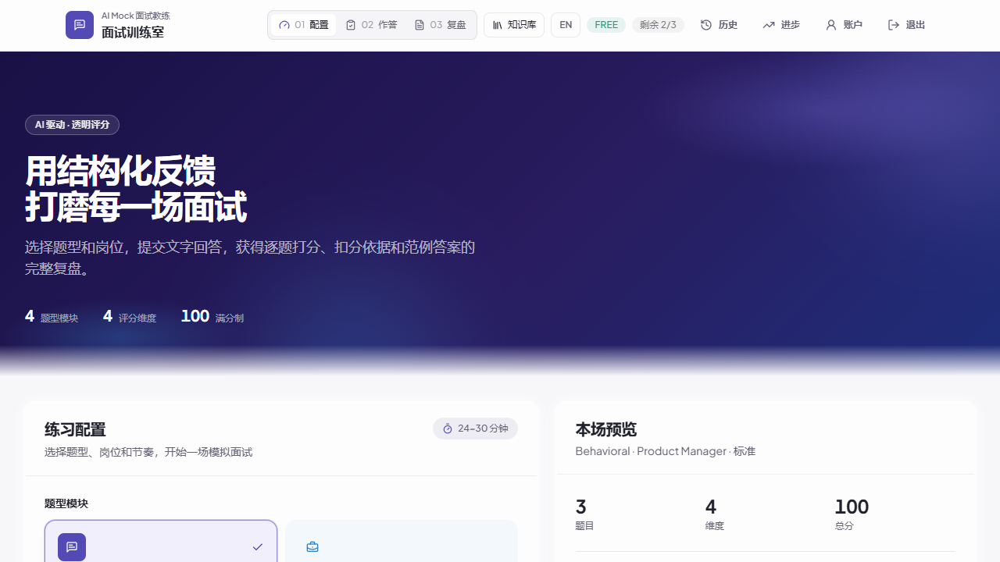
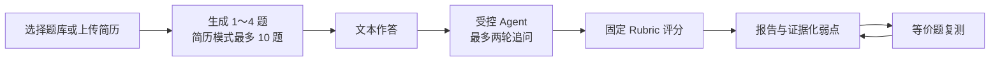
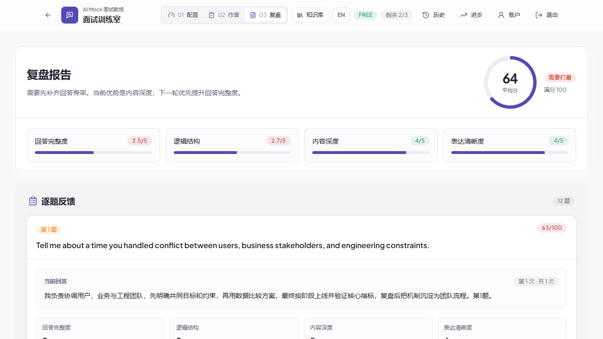

# AI Mock V2 · 面试训练室

[](https://github.com/Kevin225135/Kevin-AI-Mock-/actions/workflows/ai-evals.yml)
[](https://github.com/Kevin225135/Kevin-AI-Mock-/actions/workflows/security.yml)
[](https://github.com/Kevin225135/Kevin-AI-Mock-/actions/workflows/deploy.yml)

AI Mock 不是一个“问完就结束”的聊天机器人，而是一套有证据、有边界、可复测的面试训练闭环。它从简历或题库生成问题，用受控追问澄清回答，按固定 Rubric 给出结构化反馈，并把弱点变成下一场可验证的训练任务。



## 一次训练如何工作



- 普通题库会话最多 4 题；选择已解析简历后最多生成 10 道不重复、可追溯到简历证据的问题。
- 回答后，Agent 只能在 `DEEPEN / CHALLENGE / NEXT / STOP` 四个动作中决策，最多追问两轮。
- 报告按回答完整度、逻辑结构、内容深度、表达清晰度四维评分，展示扣分依据、建议和示例答案。
- 每场最多沉淀 3 个证据化弱点；用户可以确认、忽略或安排复测，模型不能直接修改训练状态。



## V2 能力

| 能力 | 产品取舍 |
| --- | --- |
| 简历驱动提问 | 支持 PDF、DOC、DOCX、PNG、JPG、WebP（最大 10 MB）；原始文件不落盘，只保存提取文本和结构化结果 |
| 10 题简历面试 | 先覆盖不同能力，再从证据核验、方案取舍、结果验证三个角度补题；远程改写重复时回退到本地唯一题 |
| 受控 Agent | LLM 只建议动作；状态机、工具白名单、置信度、轮次和成本边界由代码执行 |
| 结构化评分 | 固定版本 Rubric；重答追加新 Attempt，不覆盖首次回答；只比较相同 Rubric 版本 |
| 弱点复测 | 从扣分证据生成训练任务，并用“同能力、不同场景”的等价题跨 Session 验证改善 |
| 双域 Hybrid RAG | 检索用户已确认事实与审核面试知识；PostgreSQL 全文 + 向量候选 + RRF + 可选 reranker |
| Memory | Fact、Preference、Weakness、TrainingState、Temporary 分型；带来源、置信度、过期和用户 CRUD |
| Trace / Bad Case | 持久化 Retrieval、Model、Decision、Tool、Score 与降级步骤；敏感内容脱敏或哈希，可回放、可归因 |
| 安全降级 | Prompt Injection 检测、跨用户隔离、模型/Tool 超时、Token/成本预算和确定性本地 fallback |

## Agent 的边界

AI Mock 把模型视为“不完全可信的建议者”，不是工作流控制器。

- 允许读取：当前回答、检索证据、评分上下文。
- 不允许写入：用户 Memory、弱点状态、训练任务状态、会话所有权。
- 非法输出、低置信度、超时或超预算时，系统回退到确定性策略并记录原因码。
- Trace 默认保存在本地 PostgreSQL；只有显式启用且配置完整密钥时才导出到 Langfuse。

## 已验证到什么程度

以下是 2026-08-28 发布候选的工程证据，不等同于真实用户效果：

| 门禁 | 结果 |
| --- | --- |
| 数据库 | 18 个 Prisma 迁移；全新安装和现有 `main` 升级路径均通过 |
| 自动化测试 | 58/58（包含数据库纵向闭环） |
| 冻结评测集 | 318 条，稳定 hash 与 TRAIN/VALIDATION/TEST 切分 |
| Promptfoo | 4/4，100% pass |
| Hybrid RAG | 14 条双语 Gold Query：Recall@5=1.0、MRR@5=0.95238、nDCG@5=0.96429 |
| 工程质量 | TypeScript、ESLint、Next.js 15.5.24 production build 全部通过 |
| 浏览器闭环 | 登录 → 4 题 → 受控追问 → 报告；新导航控制台 0 error / 0 warning |
| 安全 | Gitleaks 0 泄漏；`npm audit --omit=dev` 0；Trivy High/Critical 0（CI 在线复扫） |

重要边界：318 条冻结样本的人工 Gold 数量仍为 **0**；真实试点参与者和事件分母仍为 **0**。当前可以声称“工程闭环和回归门禁成立”，不能声称“用户面试表现已经提升”。完整证据见 [V2 发布证据](docs/v2-release-evidence.md)。

## 快速体验

### Windows 便携版

从 GitHub Releases 下载 `AI-Mock-Portable-Windows-x64-v2.0.0.zip`，解压后双击 `START_AI_MOCK.cmd`。压缩包内置 Node.js、PostgreSQL 和全新演示数据库，默认只监听 `127.0.0.1:3000`，不要求测试电脑安装开发环境。

- 演示账号：`demo@ai-mock.local`
- 演示密码：`demo-password-change-me`
- 停止服务：双击 `STOP_AI_MOCK.cmd`

默认不启用外部模型、远程 embedding/reranker、联网搜索、Redis 或 Langfuse。需要调用自己的模型时，复制 `optional-model.env.example` 为 `optional-model.env` 并填写自己的 Key；Key 不会写入发布 ZIP。

### 从源码运行

前置条件：Node.js 22+、PostgreSQL 17、npm。

```powershell
Copy-Item .env.example .env
# 编辑 .env：至少设置 DATABASE_URL 和随机的 AUTH_JWT_SECRET
npm ci
npm run db:generate
npm run db:setup
npm run dev
```

打开 `http://localhost:3000`，使用上面的演示账号登录。生产环境和多人测试环境必须修改演示密码并使用独立的 JWT 密钥。

## 可选模型与检索

- 默认回归环境：`AI_PROVIDER=local`、`EMBEDDING_PROVIDER=local`、`RERANK_ENABLED=false`，不产生外部调用。
- 文本模型：支持 OpenAI-compatible（如 DashScope）和火山方舟 Ark Responses API。
- 远程 embedding / reranker：必须显式配置 provider 与 Key；切换 embedding provider 后需运行 `npm run knowledge:seed` 重建向量。
- Langfuse：只有 `LANGFUSE_TRACE_ENABLED=true` 且公私钥完整时才导出脱敏 Trace。

真实 Key 只放在被 Git 忽略的 `.env`、`.env.local` 或便携版 `optional-model.env` 中。

## 常用命令

```bash
npm run typecheck          # TypeScript
npm run lint               # ESLint，0 warning gate
npm test                   # 单元/契约测试
npm run eval:ci            # 冻结集 + 切片 + Hybrid RAG + Promptfoo
npm run build              # Next.js standalone production build
npm run db:deploy          # 应用已有 Prisma 迁移
npm run privacy:purge      # 清理超过保留期的简历数据
```

构建 Windows 便携包前先完成 production build，然后运行：

```powershell
.\scripts\build-portable-release.ps1 `
  -OutputRoot "C:\releases\AI-Mock-v2.0.0" `
  -ArchivePath "C:\releases\AI-Mock-Portable-Windows-x64-v2.0.0.zip"
```

## 架构

- `src/app`：Next.js App Router 页面与 Route Handlers
- `src/lib/domain`：会话、Attempt、弱点、训练任务与状态机
- `src/lib/ai`：Provider、预算、评分 Schema、受控 Agent 决策、Prompt 与安全降级
- `src/lib/rag`：简历证据检索与追问缺口分析
- `src/lib/knowledge`：双域全文/向量检索、RRF、reranker 与来源质量
- `src/lib/observability`：Run/Step Trace、脱敏、Langfuse 与 Bad Case 关联
- `src/lib/repositories`：Prisma/PostgreSQL 数据访问
- `evals`：冻结数据集、检索 Gold Query 与 Promptfoo Gate
- `portable`、`scripts/build-portable-release.ps1`：可复现 Windows x64 发布工程

更多资料：[V2 任务清单](docs/v2-tasks.md) · [架构说明](docs/architecture.md) · [RAG 研究与设计](docs/RAG_RESEARCH_AND_DESIGN.md) · [部署说明](docs/deployment.md) · [开发日志](docs/v2-development-log.md)

## 隐私与限制

- 原始简历文件只用于当次解析，不落盘；提取后的文本属于用户数据，可通过账户功能删除，并支持保留期清理。
- 便携包不包含开发电脑的 `.env.local`、API Key、简历、历史用户数据或共享 JWT 密钥。
- 图片 OCR 首次下载语言包时可能联网；离线测试优先使用 PDF/DOC/DOCX。
- 本项目目前没有声明开源许可证。代码可公开查看，但复用、修改或再分发前请先联系仓库维护者。

---

V2 的产品判断很简单：好的 AI 面试产品不只要“像面试官”，还要让每一次建议都能追溯、每一个弱点都能复测、每一次模型失误都能降级和复盘。
