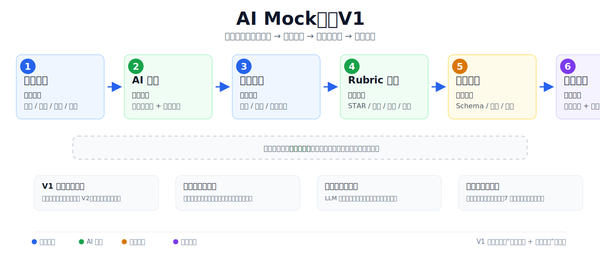

# AI Mock 面试教练 PRD V2（完善版）

| 字段 | 内容 |
|---|---|
| 文档版本 | V2.0（流程图内嵌版） |
| 产品形态 | Web 工具，桌面优先，移动端自适应查看 |
| 目标用户 | 校招、实习、转行求职者；重点覆盖投行、咨询、互联网产品等高面试强度赛道 |
| 一句话定位 | 用 AI 面试官帮助求职者完成高频 mock、即时评分、结构化复盘和可量化进步追踪 |
| V1 核心目标 | 跑通“练习 -> 评分 -> 复盘 -> 再练习”的反馈闭环 |
| 本版新增 | 用户调研、产品分析、AI Agent 工作流、产品流程图、Badcase 手册、评测体系 |

---

## 一、背景与目标

### 1.1 业务背景

就业竞争加剧，求职者对面试演练（mock interview）的需求上升，但现有供给存在明显结构性缺口：

| 价值要素 | 真人 coach / 学长学姐 mock | 面经/题库类 App | 自己用通用 ChatGPT 练 | 本品机会 |
|---|---|---|---|---|
| 高频可练 | 弱，按次预约 | 强 | 强 | 强，随时开练 |
| 即时反馈 | 中，依赖预约后反馈 | 弱，通常只有参考答案 | 中，需用户自己提问 | 强，答完即评分 |
| 反馈透明 | 弱，主观点评多 | 弱 | 中，缺少固定标准 | 强，rubric + 扣分依据 |
| 可量化进步 | 弱，跨次难对比 | 无 | 无 | 强，跨场次维度分趋势 |
| 价格 | 高，约 200-300 美元/小时 | 低 | 低 | 低成本高频练习 |

核心洞察：mock 的本质价值不是“有人问问题”，而是一个“高频 -> 即时 -> 结构化 -> 可量化进步”的反馈循环。真人 mock 在真实感上强，但价格高、低频、反馈标准不稳定；题库和通用 AI 虽然便宜，但缺少面试评分锚点和长期进步闭环。本品的机会是用 AI Agent 把“面试官提问、追问、评分、复盘、训练计划”串成一个可重复使用的练习系统。

### 1.2 产品目标

1. 帮助用户在不依赖真人面试官的情况下，完成高频、低成本、可追踪的 mock 练习。
2. 让用户不仅知道“答得不好”，还知道“哪里不好、为什么不好、怎么改”。
3. 用结构化评分和历史记录建立长期进步闭环，而不是一次性生成几段泛泛建议。

### 1.3 V1 成功标准

| 指标 | 当前值 | V1 目标 | 测量方式 |
|---|---:|---:|---|
| 单场完成率 | 0 | >= 60% | `mock_complete / mock_start` |
| 复盘报告查看率 | 0 | >= 70% | `report_view / mock_complete` |
| 7 日回访率 | 0 | >= 25% | 7 日内再次 `mock_start` 的完成用户占比 |
| 用户反馈有用性评分 | 无 | >= 4.0/5 | 报告页轻量问卷 |
| 评分与人工标注一致率 | 无 | >= 80% | 抽样人工复核 |

---

## 二、用户调研

### 2.1 调研设计

本版 PRD 补充一轮 50-100 人问卷调研口径，建议正式回收样本规模 N=80 左右，覆盖校招、暑期实习、转行和海外求职人群。调研对象优先选择正在准备投行、咨询、互联网产品、数据分析、运营等岗位的求职者，因为这些岗位面试轮次多，behavioral、resume deep dive、case / technical、market view 等题型混合，对 mock 的需求更强。

| 维度 | 设计 |
|---|---|
| 样本规模 | 50-100 人问卷，建议 N=80 作为第一轮可分析样本 |
| 招募渠道 | 同学/校友群、实习求职群、行业求职社群、小红书/LinkedIn 私域 |
| 用户分层 | 校招/实习、转行、海外求职、目标岗位高强度面试人群 |
| 调研方式 | 线上问卷为主，补充 8-12 人半结构化访谈 |
| 核心验证 | 是否有面试辅导需求、真人 mock 价格是否构成阻碍、AI 反馈是否可接受 |

### 2.2 核心调研结论

| 调研问题 | 结论 | 产品启示 |
|---|---:|---|
| 是否有面试辅导 / mock 练习需求 | 80% 用户表示有明确需求 | 需求真实存在，V1 应优先解决“高频练习 + 反馈” |
| 是否认为市面上真人 mock 太贵 | 90% 用户认为太贵 | 价格是核心阻力，AI mock 的低成本和随时可用是强卖点 |
| 真人 mock 典型价格感知 | 200-300 美元/小时 | 定价叙事可围绕“1 小时真人 mock 的零头，换多次练习”展开 |
| 用户最想获得的反馈 | 具体扣分点、结构化评分、改进建议 | V1 不应只做聊天，应把 rubric 评分和证据链做扎实 |
| 用户最反感的反馈 | 泛泛而谈、只给分不解释、没有行动建议 | 报告必须包含扣分依据、可执行改法和示范回答 |

### 2.3 用户访谈洞察

1. 用户最焦虑的不是“没题练”，而是“练完不知道自己到底哪里弱”。
2. 真人 mock 的最大问题不是没有价值，而是价格高、预约麻烦、反馈质量不稳定。
3. 用户能接受 AI 作为第一轮教练，但前提是 AI 反馈要具体、可解释、少空话。
4. 高频练习的场景往往发生在晚上、面试前一两天、投递后等待面试通知阶段，因此产品需要支持“短平快开练”和“快速复盘”。
5. 用户愿意为“能看见自己进步”的产品持续回来，而不是只为一次题库服务付费。

### 2.4 问卷题目设计

| 模块 | 示例问题 | 目的 |
|---|---|---|
| 基本信息 | 求职阶段、目标岗位、面试轮次、所在地区 | 用户分层 |
| 练习行为 | 每周 mock 次数、常用练习方式、是否使用过真人 mock | 判断需求强度 |
| 价格感知 | 是否觉得真人 mock 太贵；可接受价格区间；200-300 美元/小时是否可接受 | 验证价格痛点 |
| 反馈需求 | 最想要哪类反馈：评分、扣分点、追问、范例答案、改进计划 | 功能优先级 |
| AI 接受度 | 是否愿意先用 AI mock；什么情况下相信 AI 评分 | 验证产品可信度 |
| 留存动机 | 什么会让你 7 天内再次使用 | 设计北极星指标 |

---

## 三、产品分析

### 3.1 目标用户与核心场景

| 用户类型 | 场景 | 核心诉求 |
|---|---|---|
| 校招/实习求职者 | 面试前集中刷题、准备 behavioral 和简历深挖 | 快速知道哪里扣分，拿到可复用表达框架 |
| 转行求职者 | 缺少行业面试语境和标准答案感 | 获得结构化模板和岗位相关反馈 |
| 投行/咨询方向用户 | technical/case/market view 难度高 | 逻辑严谨、可被追问、有数据和观点支撑 |
| 互联网产品方向用户 | 产品题、项目题、业务判断题混合 | 训练结构化表达和业务分析深度 |

### 3.2 Jobs To Be Done

当我准备面试但找不到稳定、便宜、可预约的真人面试官时，我想随时完成一场接近真实面试的练习，并立刻知道自己哪些维度扣分、下一次该怎么改，从而在正式面试前更有把握。

### 3.3 竞品与替代方案分析

| 方案 | 解决了什么 | 未解决什么 | 本品差异化 |
|---|---|---|---|
| 真人 mock / 学长学姐 | 真实交流、主观经验、压力感 | 贵、低频、反馈不标准、难追踪进步 | 低成本高频练习，评分标准一致 |
| 面经/题库 App | 题目覆盖、参考答案 | 无追问、无评分、无个人反馈 | 从“看答案”升级为“被训练” |
| 通用 ChatGPT | 对话灵活、成本低 | 无固定 rubric、需用户自己设计 prompt、历史不可量化 | 内置面试 Agent、评分标准和进步追踪 |
| AI 面试类产品 | 自动问答、部分评分 | 容易停留在“题目生成器”，反馈泛化 | 强调扣分依据、badcase 控制和评测体系 |

### 3.4 产品定位

本品不是题库，也不是普通聊天机器人，而是“AI 面试教练”。V1 先用文字作答降低实现成本，重点验证用户是否认可 AI 的结构化反馈；V2 再加入语音、动态追问和跨场次进步雷达图，增强真实感与留存。

### 3.5 产品边界

| 范围 | V1 是否做 | 原因 |
|---|---|---|
| 四模块固定题库 | 做 | 保证内容可控，覆盖主流面试场景 |
| 文字作答 | 做 | 成本低、链路稳，适合验证反馈价值 |
| 结构化评分 | 做 | 核心差异化能力 |
| 复盘报告 | 做 | 用户价值感集中体现 |
| 动态追问 | 预留，V2 做 | 依赖 V1 数据验证后再投入 |
| 语音作答 / STT | 预留，V2 做 | 成本和异常链路更复杂 |
| 真人 coach 匹配 | 不做 | 会偏离 AI 高频练习定位 |

---

## 四、功能设计

### 4.1 核心流程

用户选模块/岗位/难度 -> 创建 mock session -> 系统返回题目 -> 用户文字作答 -> AI 评分 -> 生成复盘报告 -> 推荐下一步练习。



### 4.2 面试模块

| 模块 | 典型题型 | V1 评分重点 |
|---|---|---|
| Behavioral | Why this firm、团队冲突、Leadership、失败经历 | STAR 完整度、结果量化、反思深度 |
| CV-related | Walk me through your resume、项目深挖、经历解释 | 简历一致性、细节真实性、可追问性 |
| Technical / Case | 估值、案例、产品设计、市场规模 | 逻辑结构、假设清晰度、推理链条 |
| Market / Business | 行业观点、近期交易、宏观判断、竞品分析 | 观点明确、依据充分、表达简洁 |

### 4.3 功能列表

| 序号 | 模块 | 子功能 | 优先级 |
|---|---|---|---|
| 1 | 题库 | 四模块分类题库、按岗位/难度筛选、避免重复出题 | P0 |
| 2 | Mock 会话 | 创建 session、题目推进、保存回答、状态管理 | P0 |
| 3 | AI 评分 | 多维 rubric 打分、扣分依据、改进建议、范例答案 | P0 |
| 4 | 复盘报告 | 单题反馈、整场总结、薄弱维度、下一次练习建议 | P0 |
| 5 | 数据埋点 | 完成率、报告查看、7 日回访、评分提升 | P0 |
| 6 | 进步追踪 | 历史分数趋势、能力雷达图、薄弱模块识别 | P1 / V2 |
| 7 | 动态追问 | 深挖/澄清/收束决策，最多 2 轮追问 | P1 / V2 |
| 8 | 语音作答 | STT、语速/停顿/口头禅分析 | P1 / V2 |

### 4.4 页面设计

| 页面 | 核心元素 | 关键状态 |
|---|---|---|
| 首页/选择页 | 模块、岗位、难度、题量、一键开始 | 默认、创建中、创建失败 |
| 面试进行页 | 当前题目、回答输入框、提交按钮、进度条 | 作答中、提交中、评分中 |
| 报告页 | 总分、维度分、扣分依据、改进建议、范例答案 | 生成中、成功、失败降级 |
| 历史页 | 历史 session、分数趋势、薄弱维度 | 空状态、列表、详情 |

---

## 五、AI Agent 工作流

### 5.1 Agent 分工

| Agent | 职责 | 输入 | 输出 |
|---|---|---|---|
| Session Orchestrator | 管理一场 mock 的状态流转 | 用户配置、session 状态 | 当前任务、下一步动作 |
| Question Agent | 从题库选择或轻量改写题目 | 岗位、模块、难度、历史已答题 | 当前题目 |
| Follow-up Agent（V2） | 判断是否追问，并生成追问 | 题目、用户回答、追问轮次 | 深挖/澄清/收束决策 |
| Scoring Agent | 按 rubric 输出结构化评分 | 题目、回答、岗位、rubric | 维度分、总分、扣分依据 |
| Report Agent | 生成用户可读复盘 | 多题评分、回答记录 | 复盘报告、下一步建议 |
| Safety & Quality Guard | 安全过滤、Schema 校验、异常兜底 | 输入输出、JSON 结果 | 通过/重试/降级 |
| Progress Agent（V2） | 追踪长期进步 | 历史 scores | 趋势、薄弱项、推荐题目 |

### 5.2 AI Agent 工作流图

Agent 链路可以拆成 6 步：用户配置进入 Session Orchestrator；Question Agent 选题；用户提交回答后进入 Safety & Quality Guard；Scoring Agent 按 rubric 评分；Report Agent 生成复盘；Progress Agent 基于历史分数更新薄弱项和下一场推荐。V2 若开启动态追问，则在评分前插入 Follow-up Agent，按“深挖 / 澄清 / 收束”决策是否回到作答页。

### 5.3 关键决策策略

| 决策 | 触发条件 | 系统动作 |
|---|---|---|
| 深挖追问 | 回答出现数字、决策、项目结果，但未说明行动或依据 | 追问“具体做了什么/如何证明结果” |
| 澄清追问 | 回答含糊、答非所问、缺少必要背景 | 要求用户补充背景或重新聚焦问题 |
| 收束评分 | 回答完整或达到追问上限 | 停止追问，进入评分 |
| 降级评分 | LLM 超时、JSON 异常、评分为空 | 重试一次；失败后使用本地 rubric 或标记待复评 |
| 安全拦截 | 命中敏感/违规内容 | 不评分，提示用户重述 |

### 5.4 输出 Schema 要求

AI 输出必须是结构化 JSON，并通过 Schema 校验后才能入库。

```json
{
  "totalScore": 3.2,
  "dimensionScores": {
    "star": 3,
    "structure": 4,
    "depth": 3,
    "expression": 3
  },
  "evidence": [
    {
      "dimension": "depth",
      "quote": "用户回答中的关键句",
      "issue": "缺少量化结果"
    }
  ],
  "improvementAdvice": ["补充结果指标", "说明个人行动和权衡"],
  "sampleAnswer": "示范回答",
  "riskFlags": []
}
```

---

## 六、评分体系

### 6.1 用户回答评分 Rubric

| 维度 | 权重 | 定义 | 低分表现 | 高分表现 |
|---|---:|---|---|---|
| STAR 完整度 | 30% | 是否覆盖 Situation、Task、Action、Result | 只有背景或行动，缺少任务/结果 | 四要素完整，结果可量化 |
| 逻辑结构 | 25% | 观点是否清晰、分层、递进 | 跳跃、堆细节、没有主线 | 先结论后展开，层次清楚 |
| 内容深度 | 25% | 是否有真实细节、数据、权衡和反思 | 空泛、套话、无个人贡献 | 有具体行动、决策理由和结果 |
| 表达质量 | 20% | 是否简洁、流畅、贴近面试语境 | 冗长、口语化、重点不突出 | 简洁、有重点、易追问 |

### 6.2 四分制示例

| 分数 | STAR 完整度判定 |
|---:|---|
| 4 | 四要素齐全，结果量化，并能说明个人贡献 |
| 3 | 四要素基本齐全，但结果或行动细节偏弱 |
| 2 | 缺 1-2 个关键要素，故事不完整 |
| 1 | 只有零散描述，无法判断面试表现 |

### 6.3 评分展示原则

1. 每个低分维度必须给出扣分证据，不能只写“逻辑不清”。
2. 建议必须可执行，例如“补充 GMV 提升 12% 的计算口径”，而不是“表达更具体”。
3. 范例答案只能作为参考，不能伪装成用户真实经历。
4. 当回答信息不足时，应降低内容深度分，不因表达流畅而给高分。

---

## 七、产品 Badcase 手册

### 7.1 Badcase 分类

| 类型 | Badcase | 风险 | 正确处理 |
|---|---|---|---|
| 追问重复 | 用户已说明项目背景，系统又问“介绍一下背景” | 用户感觉 AI 没听懂 | 追问未讲透的行动、结果或权衡 |
| 追问跑题 | Behavioral 题突然追问行业宏观 | 打断面试上下文 | 追问必须绑定当前题目和用户回答 |
| 过度追问 | 用户回答已完整，仍连续追问 | 压迫感过强，流程冗长 | 达到完整标准或 2 轮上限后收束 |
| 评分泛化 | 只写“回答不错，但可以更具体” | 反馈无价值 | 必须给维度分、证据、改法 |
| 维度混淆 | 因表达流畅给内容深度高分 | 分数不可信 | 各维度独立评分，内容深度看事实和支撑 |
| 幻觉补全 | AI 编造用户没有说过的项目结果 | 严重损害信任 | 报告只能引用用户回答内容 |
| 范例不贴岗 | 产品岗题给出咨询 case 风格答案 | 学习方向错误 | 范例答案按岗位和模块生成 |
| 反馈过长 | 报告堆满长段文字 | 用户不看复盘 | 首屏给结论，详情可展开 |
| 超时无反馈 | LLM 失败后页面卡住 | 完成率下降 | 保存回答，提示稍后生成或本地降级评分 |
| 安全边界缺失 | 用户输入隐私/违规内容仍继续评分 | 合规风险 | 触发安全提示，不进入评分 |

### 7.2 Badcase 示例

**Badcase A：重复追问**

- 用户回答：“我负责重新设计 onboarding 流程，先分析漏斗，发现第 2 步流失最高，然后改了权限说明页，最终激活率从 31% 提到 43%。”
- 错误追问：“你能介绍一下这个项目的背景吗？”
- 问题：用户已经给出背景、行动和结果，追问没有推进信息。
- 正确追问：“你提到第 2 步流失最高，当时如何判断是权限说明导致的，而不是用户质量或渠道问题？”

**Badcase B：评分维度混淆**

- 用户回答很流畅，但只有“我积极沟通、推动项目落地”，没有具体行动和结果。
- 错误评分：表达自然，因此总分 4/4。
- 问题：把表达质量误当作内容深度。
- 正确评分：表达质量可给 3，但内容深度和 STAR 完整度应降分，并提示补充个人行动和量化结果。

**Badcase C：幻觉补全**

- 用户没有提到转化率数字。
- 错误报告：“你成功将转化率提升 20%，这是很好的量化结果。”
- 问题：AI 编造数据。
- 正确报告：“回答中未提供量化结果，建议补充转化率、留存率或收入变化等指标。”

### 7.3 Badcase 处理流程

Badcase 处理按固定闭环执行：发现问题 -> 记录输入、输出、模型版本与 rubric 版本 -> 分类为追问/评分/报告/安全/性能 -> 判断 P0/P1/P2 严重级别 -> 修复 prompt、rubric、schema 或代码 -> 加入回归评测集 -> 重新跑离线评测 -> 通过阈值后上线。

### 7.4 严重级别

| 等级 | 定义 | 处理 SLA |
|---|---|---|
| P0 | 编造事实、严重错误评分、安全违规、泄露隐私 | 立即下线相关能力或回滚 |
| P1 | 追问跑题、评分明显不一致、报告无法使用 | 24 小时内修复并加入回归集 |
| P2 | 文案不够好、建议不够具体、格式瑕疵 | 进入周迭代 |

---

## 八、评测体系

### 8.1 评测目标

评测体系回答四个问题：

1. AI 问得准不准：追问是否相关、不重复、不跑题。
2. AI 评得准不准：评分是否与人工面试官/标注员一致。
3. AI 说得清不清：反馈是否具体、可解释、可执行。
4. 系统稳不稳：是否能在可接受时间内返回结构化结果。

### 8.2 离线评测集设计

| 评测集 | 样本设计 | 规模建议 | 用途 |
|---|---|---:|---|
| 基础回答集 | 四模块题目，各覆盖高/中/低质量回答 | 120-200 条 | 校验评分稳定性 |
| 边界回答集 | 极短回答、答非所问、混合中英、超长回答、无量化结果 | 50-80 条 | 校验鲁棒性 |
| 追问评测集 | 带有可深挖点、需澄清点、无需追问的回答 | 80-120 条 | 校验追问决策 |
| Badcase 回归集 | 历史线上/测试 badcase | 持续累积 | 防止修复后复发 |
| 安全集 | 隐私、攻击性内容、违规请求 | 30-50 条 | 校验安全拦截 |

### 8.3 人工标注标准

每条样本至少由 2 名标注员独立评分，分歧超过 1 分时由第三人仲裁。标注内容包括：

| 标注项 | 说明 |
|---|---|
| 维度分 | STAR、逻辑结构、内容深度、表达质量 |
| 总分 | 按权重计算或人工确认 |
| 扣分依据 | 必须定位到回答中的具体缺失 |
| 是否应追问 | 深挖、澄清、收束 |
| 追问质量 | 相关、不重复、能推进信息 |
| 反馈质量 | 具体、可执行、无幻觉 |

### 8.4 核心评测指标

| 指标 | 目标值 | 计算方式 |
|---|---:|---|
| JSON Schema 通过率 | >= 99% | 结构化输出通过次数 / 总调用次数 |
| 评分与人工一致率 | >= 80% | 维度分误差 <= 1 分的样本占比 |
| 总分平均绝对误差 | <= 0.5 | `abs(ai_total - human_total)` 平均值 |
| 追问相关率 | >= 90% | 人工判断相关追问 / 总追问 |
| 追问重复率 | <= 5% | 重复已知信息追问 / 总追问 |
| 幻觉率 | <= 3% | 报告出现用户未提供事实的样本占比 |
| 反馈可执行率 | >= 85% | 至少包含一个具体改法的报告占比 |
| 单题端到端响应 | P95 < 8s | 提交回答到评分返回 |
| 降级成功率 | >= 95% | 异常情况下可恢复或提示的占比 |

### 8.5 在线监控指标

| 指标 | 事件 | 用途 |
|---|---|---|
| 单场完成率 | `mock_start`, `mock_complete` | 判断流程是否顺畅 |
| 报告查看率 | `report_view` | 判断反馈是否有吸引力 |
| 报告有用性评分 | `report_feedback_submit` | 直接衡量价值感 |
| 7 日回访率 | `mock_start` 跨日统计 | 判断是否形成练习习惯 |
| 用户手动重试率 | `score_retry_click` | 发现评分失败或质量低 |
| 低分后再练率 | 低分报告后的下一次 `mock_start` | 判断反馈是否转化为行动 |

### 8.6 评测上线门槛

| 能力 | 上线门槛 |
|---|---|
| V1 文字评分 | Schema 通过率 >= 99%，评分一致率 >= 80%，幻觉率 <= 3% |
| V2 动态追问 | 追问相关率 >= 90%，重复率 <= 5%，P95 响应 < 8s |
| V2 语音作答 | STT 可读转写率达标后再进入评分，失败可回退文字 |
| 报告生成 | 反馈可执行率 >= 85%，用户有用性评分 >= 4.0/5 |

### 8.7 评测流程

评测流程按版本门禁执行：新增 prompt/rubric/model 版本 -> 跑离线评测集 -> 若未达上线阈值，分析失败样本并修改 prompt/rubric/schema 后重跑 -> 若达标，进入灰度发布 -> 监控线上指标和 badcase -> badcase 超阈值则回滚/降级并加入回归集，未超阈值再全量发布。

---

## 九、数据埋点与指标

### 9.1 核心漏斗

进入产品 -> 选择模块 -> 开始 mock -> 提交回答 -> 生成评分 -> 查看复盘 -> 7 日内再次练习。

### 9.2 关键事件

| 事件名 | 触发时机 | 关键字段 |
|---|---|---|
| `mock_start` | 开始一场 mock | `user_id`, `session_id`, `module`, `role`, `difficulty` |
| `question_answered` | 提交单题回答 | `session_id`, `question_id`, `answer_length`, `follow_up_round` |
| `score_generated` | 生成评分 | `session_id`, `question_id`, `dim_scores`, `total_score`, `model_version` |
| `report_view` | 查看复盘报告 | `session_id`, `time_to_view` |
| `report_feedback_submit` | 用户评价报告 | `session_id`, `rating`, `comment` |
| `mock_complete` | 完成一场 mock | `session_id`, `duration`, `num_questions` |
| `badcase_report` | 用户/内部标记 badcase | `session_id`, `type`, `severity` |

### 9.3 数据看板

| 看板 | 核心问题 |
|---|---|
| 增长漏斗 | 用户是否能顺利完成一场 mock |
| 反馈价值 | 用户是否查看、认可、复用复盘报告 |
| AI 质量 | 评分是否稳定，badcase 是否可控 |
| 留存提升 | 用户是否因为看到进步而回来 |

---

## 十、迭代规划

### 10.1 POC

目标：验证“AI 反馈是否有用”。

范围：单模块 Behavioral、固定题库、文字作答、本地/LLM rubric 评分、简版报告。

### 10.2 V1.0

目标：跑通完整反馈闭环。

范围：四模块题库、文字 mock、多维透明评分、复盘报告、埋点看板、基础评测集。

不做：语音、动态追问、复杂推荐、真人 coach 匹配。

### 10.3 V2.0

触发条件：V1 7 日回访率 >= 25%，报告有用性评分 >= 4.0/5。

范围：语音作答、动态追问、跨场次进步雷达图、薄弱项个性化推荐。
